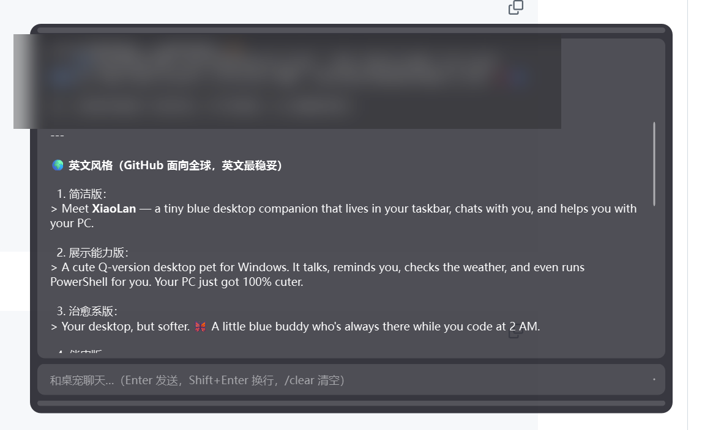
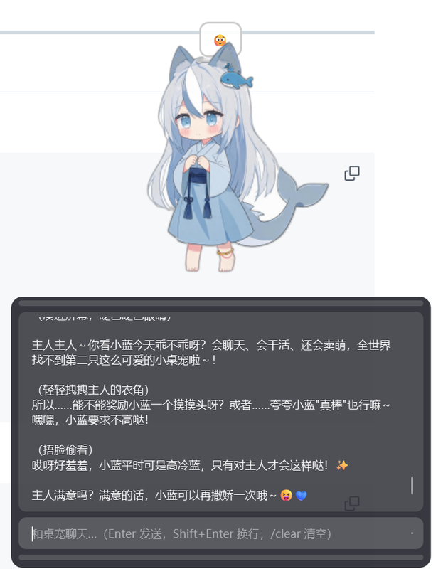

# DeepSeek Desktop Pet 🐋⚡


A Q-style desktop pet living in your computer: chats with you, helps with tasks, and proactively cares about you.

> A desktop AI companion built with PySide6 + DeepSeek API — dual characters, long-term memory, function calling, and a proactive care system.



> **Note**: The UI and conversation are in Chinese by default. This project targets Chinese users, but the architecture is fully generalizable.

**[English](README.en.md) | [中文](README.md)**

## 📸 Screenshots

| AI Chat | Personality Interaction | Idle Animation |
|---------|------------------------|-----------------|
|  |  |  |

## ✨ Features

### 🎭 Dual Characters
| Character | Model | Traits |
|-----------|-------|--------|
| **V4 Flash** ⚡ | `deepseek-v4-flash` | Light-blue kimono mermaid · Quick & efficient |
| **V4 Pro** 🐋 | `deepseek-v4-pro` | Dark-blue maid whale girl · Thoughtful & analytical |

Each character has its own model, conversation history, and long-term memory.

### 🤖 AI Capabilities (function calling)
- **15+ tools**: open apps / weather / reminders / lock screen / volume / process management / file search / clipboard / todo list / memory, etc.
- **Safe PowerShell execution**: dangerous operations (delete/shutdown/format) require user confirmation, with timeout and output truncation
- **Markdown rendering**: tables, code blocks, bold text in chat panel, with streaming typewriter display

### 🧠 Long-term Memory System
- `memorize` tool: AI autonomously recognizes and remembers user preferences/facts (isolated per character)
- Memory injected into system prompt, with importance + soft overwrite + forgetting mechanism
- Conversation summarization for long sessions
- Memory management UI: view / delete / clear

### 💗 Proactive Care System (Chained Wake-up + Follow-up)
- **Chained wake-up**: AI schedules its own next wake-up (clamped 10-360 min), with lightweight no-disturbance judgment (idle detection + quiet hours)
- **Follow-up visits**: mentions of important events (going to eat / exams, etc.) → AI schedules a follow-up and proactively checks in (with state awareness)
- Wake-up judgments use isolated context — never pollutes the main conversation

### 🖥️ Desktop Pet Experience
- Transparent always-on-top window, emotion-based sprite switching (`[emotion:happy]` tags), blink/breathing/hair animations
- Integrated right-click menu: characters / chat / interactions / edge-docking / actions / personality / settings / memory management
- Global hotkey `Ctrl+Alt+P` to summon chat
- System tray, auto-start on boot (Startup folder)
- Edge-docking: drag to screen edge to dock, peek/hidden dual modes
- Chat panel: auto-expanding multi-line input, draggable resizing, timestamps, chat export

## 🚀 Quick Start

```powershell
# 1. Install dependencies
python -m pip install PySide6

# 2. Prepare config (copy template and fill in your API key)
copy config.example.json config.json
# Edit config.json, fill in deepseek_api_key

# 3. Run
python desktop_pet.py
```

> ⚠️ **You need your own DeepSeek API key** (https://platform.deepseek.com, models `deepseek-v4-flash` / `deepseek-v4-pro`).

## ⚙️ Configuration

`config.json` (see `config.example.json`):

| Field | Description |
|-------|-------------|
| `deepseek_api_key` | DeepSeek API key (required) |
| `model_flash` / `model_pro` | Model ID for each character |
| `personality` | Personality (gentle/tsundere/sarcastic/energetic/cold, or custom) |
| `reply_style` | Reply style (short/normal/detailed) |
| `max_tokens` | Max output tokens per reply (256-64000) |
| `city` | Default weather city |
| `active_chat` | Proactive care toggle |
| `app_aliases` | Custom app quick aliases |

## 🏗️ Architecture

```
┌─────────────────────────────────────────┐
│  PySide6 GUI (transparent window/sprites/chat) │
├─────────────────────────────────────────┤
│  AI Core (DeepSeek API + function calling) │
│  · system prompt: identity/personality/memory/rules │
│  · tool loop: LLM intent JSON → program executes │
│  · 15+ tools (security checks + user confirmation) │
├─────────────────────────────────────────┤
│  Memory system (memory.json, per-character) │
│  Proactive care (chained wake-up + follow-up + state) │
│  System integration (tray/hotkey/autostart/edge/clipboard) │
└─────────────────────────────────────────┘
```

### Proactive Messaging (learning notes)
A detailed write-up of LLM statelessness, Function Calling, and the chained wake-up/follow-up design: `主动消息机制学习笔记.md` (Chinese).

## 📁 Project Structure

```
desktop-pet/
├── desktop_pet.py          # Main program (single file)
├── config.example.json     # Config template
├── 启动桌宠.bat            # Windows one-click launcher
├── assets/                 # Sprite assets (AI-generated + cutout)
│   ├── flash/              # V4 Flash state sprites
│   └── pro/                # V4 Pro state sprites
├── screenshots/            # README screenshots
└── README.md
```

## 📦 Packaging as exe

```powershell
python -m PyInstaller --noconfirm --clean --onedir --windowed --name DeepSeekPet `
  --collect-all PySide6 --collect-all shiboken6 `
  --specpath release_build --workpath release_build\build --distpath release_build\dist `
  desktop_pet.py
```

> ⚠️ PyInstaller must be ≥ 6.21 (Python 3.14 support); delete `icu*.dll` from `_internal` after packaging (interferes with Qt6Core; the spec already excludes them).

## 🤝 Contributing / Roadmap

- [ ] Foreground window awareness (detect what user is doing)
- [ ] More characters / Live2D skeletal animation
- [ ] Voice interaction (TTS/ASR)
- [ ] Plugin-based tool system

## 📄 License

[MIT](LICENSE)

---

**Disclaimer**: For learning and exchange purposes. Sprites are AI-generated; please comply with the terms of the generating tools.
