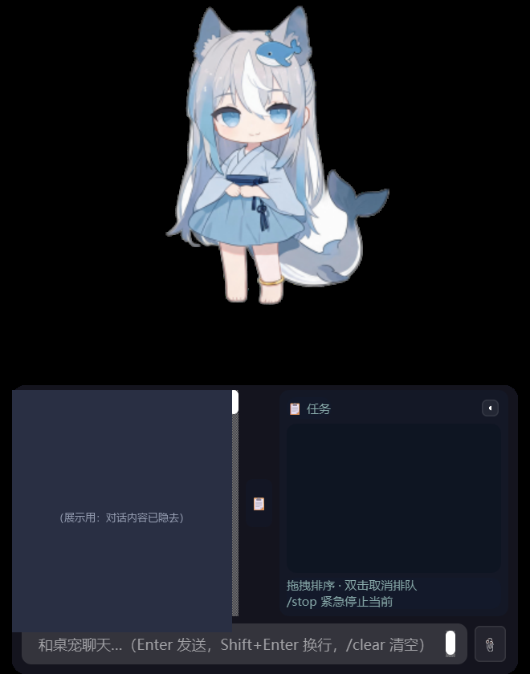
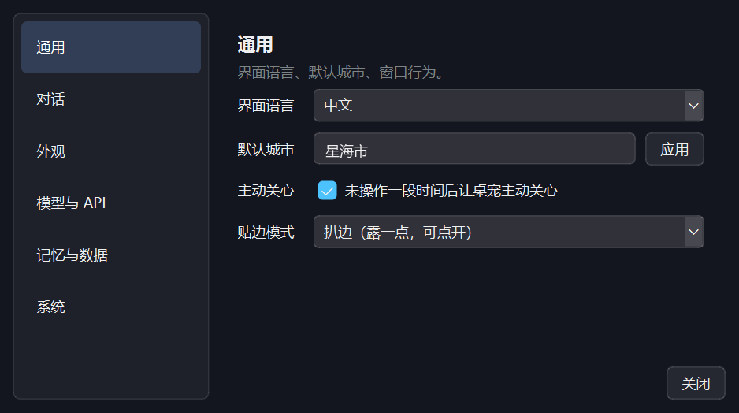
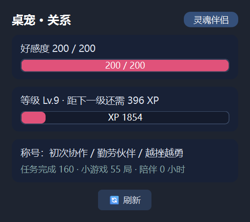
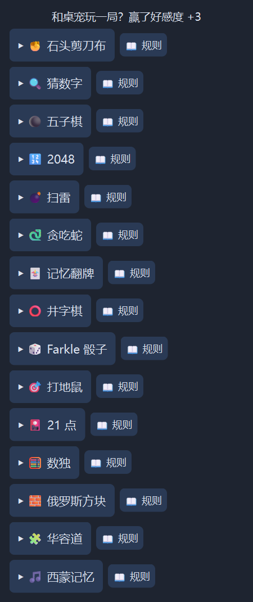
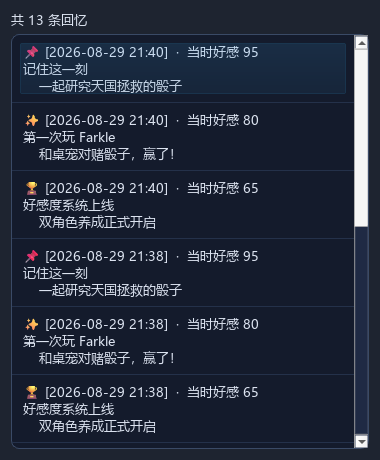
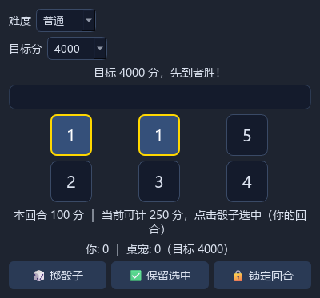
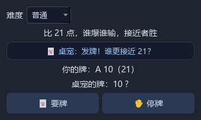
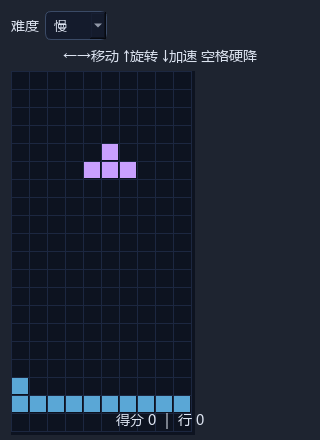

# DeepSeek 桌宠助手 🐋⚡


一只住在你电脑里的 Q 版桌宠：会陪你聊天、帮你干活、还能主动关心你。


> 基于 PySide6 + DeepSeek API 的桌面 AI 陪伴助手，支持双角色、长期记忆、工具调用、主动关心机制。

> ⚠️ 本项目为第三方开源项目，与 DeepSeek（深度求索）公司无任何关联，仅使用其公开 API。所有角色形象均为 AI 生成，不代表官方。

> 📌 版本说明：**发布版本号**见 [CHANGELOG.md](CHANGELOG.md)（语义化 `2.x`）；源码注释里的 `v6.xx`
> 是**内部开发迭代号**（`v6.19` 为开发起点）。两套编号用途不同，不是同一串版本。

**[English](README.en.md) | [中文](README.md)**

## 📸 截图

| 双角色立绘 | 表情与动作 | 运行实拍 |
|---------|---------|---------|
|  |  |  |

### 界面一览（v2.7 现状）

| 桌宠主界面（聊天 + 任务侧栏） | 统一设置窗口 | 好感度关系面板 | 小游戏大厅 |
|---------|---------|---------|---------|
|  |  |  |  |

### 养成与游戏

| 回忆相册 | Farkle 骰子 | 21 点 | 俄罗斯方块 |
|---------|---------|---------|---------|
|  |  |  |  |

| 桌宠本体（静态立绘） |
|---------|
|  |

## 🆚 与同类项目的差异（创新点）

> 本项目不是“会聊天的桌宠”，而是把「AI 陪伴」做成**可成长的长期关系**，并把**工程成本**当成产品指标来治理。

### 产品层：陪伴是一个闭环，不是单点功能

| 创新点 | 与同类项目的差异 |
|---|---|
| **陪伴链闭环** | 三层记忆（事实 / 摘要 / **事件**）→ 双轴养成（好感度 0–200 + 等级 XP）→ **五阶段人设进化**（初见 → 熟悉 → 亲密 → 依赖 → 灵魂伴侣）→ 主动关心 → 15 款小游戏 → 回忆相册。多数开源桌宠只做“聊天 + 立绘动画” |
| **主动关心 = 链式唤醒 + 定时回访** | 不是定时弹话：用户提到重要事件后自动安排回访（`schedule_followup`），叠加久坐 / 空闲感知与早安日报 |
| **桌宠能改自己的代码** | `edit_own_code` / `read_file` / `search_code` / `write_config` + 自改备份 + 语法预检 —— “自我进化”能力 |
| **可扩展架构** | 插件系统 + MCP 桥接 + 复合技能（`skill_run`），不是写死的工具集 |
| **API 成本可视化** | 用量 / 费用悬浮窗 + 花费气泡 + **按模型档案统计**，把“API 花钱”做成可观测功能 |

### 技术层：把上下文成本与 AI 行为偏差当问题解决

| 创新点 | 说明 |
|---|---|
| **真流式 + 思考可见 + 流内可中断** | 逐块取消回调：按停止即断开连接，**真停且停止计费**（不是“假装停了但还在吐字”） |
| **模型档案化（单一真相）** | 模型 ID / 参数 / 端点 / key 字段全由 `models.json` 决定，换服务商或中转只改档案 |
| **工具梯级暴露** | 默认只暴露 8 个高频工具，工具 schema **省 71%（≈3.9K token/请求）**，减少工具与人设争抢上下文 |
| **记忆过拟合治理** | 检索相关性闸门 + “记忆只作背景、不许主动引话题”约束，解决“问什么都往记忆上靠” |
| **命令安全门** | 危险命令拦截 + 105 项断言 |

### 工程层：不是玩具

- **13 个测试文件 / 57 项单测 + 40 项回归 + UI 黄金基线**（像素级对照，防 UI 回归）
- **原子写**（数据不丢）+ **静默异常全部接入日志**（50 处）
- **31 个模块**，宿主类 `__init__` 从 312 行 → **7 行**
- **中英双语 114 = 114 条，零缺失**

> 📄 过程文档见 `docs/`：**项目功能体检报告**（能不能 / 好不好 / 定位适配）、**排障与修复记录**（4 个真实缺陷的定位与修复过程）、**项目展望**（阶段判断与方向）。

## ✨ 特性

### 🎭 双显示模式（v6.81）
- **静态立绘模式**（默认）：单张 Q 版立绘，呼吸/眨眼/呆毛动画，轻量省资源
- **Live2D 模式**：30fps 连续动画——头部摆动/眨眼/呼吸/视线跟随/点击动作，右键菜单一键切换，配置持久化
- **Live2D 模型库**：自动扫描 `assets/live2d/` 目录，放入任意 `.model3.json` 模型文件夹即可在菜单中选用（当前内置官方 Mao 演示模型）
- 透明 OpenGL 内嵌渲染，两种模式完整保留拖拽/扒边/聊天等全部交互

### 🧭 右键菜单与设置
右键菜单只保留 **6 个一级项**，动作与配置分开：

| 一级项 | 里面有什么 |
|--------|-----------|
| 🤖 和 AI 聊天 | 打开聊天面板 |
| 💬 互动 | 说句话 / 思考 / 随机动作 / 喂食 / 小游戏 / 睡觉 / 隐藏聊天窗 / 场景动作（12 项一层）/ 主动关心开关 |
| 🎭 形象 | 角色切换（档案驱动）/ 静态立绘 · Live2D / 性格预设 / 更多形象设置 |
| 📌 贴边模式 | 扒边 ↔ 完全消失（一键切换） |
| 📊 状态 | 与当前角色的关系 / 回忆相册 / API 用量（统计悬浮窗·按模型统计·统计历史） |
| ⚙️ 设置… | 打开统一设置窗口 |

**统一设置窗口**（左侧六分类）：通用（语言 / 城市 / 主动关心 / 贴边）、对话（性格 / 回复风格 / 回复长度）、外观（显示模式 / Live2D 模型 / 调试窗口）、模型与 API（角色 / 思考模式 / 采样温度 / Key 与模型管理）、记忆与数据（记忆 / 提醒 / 待办 / 导出 / 存档清空）、系统（开机自启 / 程序目录）。

> 所有配置项改动**立即生效**（沿用原有热加载），设置窗口底部只有「关闭」。

### 🧮 API 用量自监控（v6.81）
- 每次 API 调用自动解析 usage（模型/输入/输出/缓存命中/费用），实时悬浮窗显示 + 统计历史
- 右键菜单 → 🔧 工具 → 📊 API 统计 / 🔄 查看统计历史 / 📈 按模型统计
- **按模型统计**：终身口径按模型汇总次数 / token / 费用，费用从高到低排序；档案里没配价格的模型会单独标出「⚠ 其中 N 次价格未知」
- **价格未知不再静默**：统计悬浮窗「最近」行与统计历史逐条记录都会标 ⚠（数值按兜底价估算）
- 数据持久化 `api_stats.json`（本地，不提交仓库）

### 🎭 双角色系统
| 角色 | 模型 | 特征 |
|------|------|------|
| **V4 Flash** ⚡ | `deepseek-flash` | 浅蓝和服人鱼 · 快言快语 · 效率优先 |
| **V4 Pro** 🐋 | `deepseek-v4-pro` | 深蓝女仆鲸鱼娘 · 深思熟虑 · 深度分析 |

每个角色独立模型、独立对话历史、独立长期记忆。

**模型身份完全可配置**（`models.json`）：显示名、模型 ID、接口地址、温度/思考开关/token 上限、价格、外观与人设，全部写在档案里而非代码里——官方改名或出新模型时改配置即可，不用动源码。右键菜单的“角色”与“模型”列表也由档案动态生成，加一条档案就多一个角色。

**图形化配置入口**：右键菜单 → ⚙️ 设置 → 🎯 模型管理…——可增删档案、逐项编辑，并带两个应对官方变动的按钮：

| 按钮 | 作用 |
|------|------|
| 🔍 拉取官方模型列表 | 调 `GET /models` 拿到当前可用 ID，下拉选择直接填入 |
| 🩺 连通性自检 | 发一个 `max_tokens=1` 的最小请求，回显「响应里的真实模型 + 耗时」 |
| 📤 导出 / 📥 导入 | 把全部档案导出成可分享的 JSON（**不含密钥**）；导入支持合并 / 整体替换 |

> 为什么要这两个按钮：官方把 `deepseek-v4-flash` 重命名成 `deepseek-flash` 后，旧 ID 仍能当别名调通，但响应里的 `model` 已被归一化。自检能把这种“静默指向”直接摆到眼前。

### 🤖 AI 能力（function calling）
- **15+ 工具**：打开程序 / 查天气 / 设提醒 / 锁屏 / 音量 / 进程管理 / 文件搜索 / 剪贴板读写 / 待办清单 / 记忆管理等
- **PowerShell 安全执行**：危险操作（删除/关机/格式化）需用户确认，超时 + 输出截断
- **Markdown 渲染**：聊天面板支持表格/代码块/粗体等渲染，流式打字机逐块显示

### 🧠 长期记忆系统
- `memorize` 工具：AI 自主识别并记住用户偏好/事实（按角色隔离）
- 记忆注入 system prompt，带重要度 + 软覆盖 + 遗忘机制
- 会话摘要滚动压缩，长对话不丢关键信息
- 记忆管理 UI：查看 / 删除 / 清空

### 💗 主动关心系统（链式唤醒 + 回访）
- **链式唤醒**：AI 自主调度下次唤醒（10~360 分钟钳制），唤醒时轻量判断是否打扰（空闲检测 + 深夜静默）
- **回访机制**：对话中提到重要事件（去吃饭/考试等）→ AI 安排定时回访，到点主动关心（带状态感知）
- 唤醒判断独立上下文，不污染主对话

### 🖥️ 桌宠体验
- 透明置顶悬浮窗，立绘随情绪切换（[emotion:happy] 等标签），眨眼/呼吸/头发动画
- 右键菜单整合：角色 / 聊天 / 互动 / 贴边 / 动作 / 性格 / 设置 / 记忆管理
- 全局热键 `Ctrl+Alt+P` 呼出聊天
- 系统托盘常驻、开机自启（启动文件夹方案）
- 贴边扒边：拖到屏幕边缘自动贴边，支持扒边/完全消失双模式
- 聊天面板：多行自适应输入框、上下左右拖拽调整、时间戳、聊天记录导出

### 💗 好感度与成长系统（v6.30 新增）
- **双轴养成**：好感度（0~200，决定关系阶段与语气）+ 等级/XP（陪伴资历，决定称号）
- **五阶段人设进化**：初见 → 熟悉 → 亲密 → 依赖 → 灵魂伴侣，system prompt 随好感度动态注入，角色从「称呼您」长成「说半句就懂你」
- **事件驱动纯积累制**：对话/任务/喂食/小游戏/早晚安/陪伴时长加好感，零衰减零惩罚，三重防刷（冷却/日上限/封顶）
- **三层记忆**：对话记忆 + 事实记忆（memorize）+ **事件记忆（回忆日志）**——共同经历自动沉淀，角色会自然提及「还记得上次…」
- **关系面板**：好感度进度条 + 阶段徽章 + 等级/XP + 称号 + 统计（右键 → ❤️ 关系）
- **回忆相册**：按时间线浏览所有共同经历（里程碑/事件/标记）（右键 → ❤️ 关系 → 📖 回忆相册）
- **情感选项（galgame 选择支）**：AI 在抉择时刻用 `offer_choices` 给出 2~3 个可点击选项，选项带好感度预测（❤️+n），点击即发送
- **余额动画气泡**：每次 API 调用角色头顶飘出费用（`-¥0.032` 上浮渐隐）
- **饱食度系统**：随时间衰减，喂食恢复 + 好感，低饱食只提示不惩罚
- **里程碑记录**：升级/阶段进化/称号解锁/破游戏纪录自动写入回忆 + 头顶庆祝

### 🎮 小游戏大厅（v6.30 新增，15 款）
- 右键 → 💬 互动 → 🎮 小游戏，每款带 📖 规则说明、难度可选、桌宠表情实时反应
- **🎲 Farkle 骰子**（天国拯救同款）：目标分 500~10000 自选，KCD 官方计分（顺子 123456=1500 / 12345=500 / 23456=750 / 四五六同 ×2×4×8），点击骰子选中保留，和桌宠轮流对赌
- **策略类**：五子棋（三档 AI）/ 井字棋 / 2048（4×4·5×5·4096）
- **益智类**：数独（24/36/48 挖空）/ 华容道（3×3·4×4）/ 扫雷（经典三档）/ 记忆翻牌（6/8/12 对）
- **反应类**：贪吃蛇（速度三档 + 黄金食物）/ 打地鼠 / 西蒙记忆 / 俄罗斯方块（速度三档）
- **对赌类**：21 点（A 智能算牌）/ 石头剪刀布（三局两胜 + 桌宠记仇）/ 猜数字（范围/限次三档）
- **高分里程碑**：每款游戏独立最高分记录，破纪录 → 桌宠庆祝 + 回忆日志 + 额外好感

### 🎭 动作素材扩充（v6.30）
- 新增 12 个动作状态（饿/胜利/亲亲/沮丧/跳舞/唱歌/大哭/惊讶/得意/求摸头/撒娇抱抱/送花），双角色齐全（37 状态）
- 触发联动：饱食度低 → 饥饿图；小游戏胜负 → 欢呼/沮丧图；喂食 → 亲亲图
- 互动菜单精简：常用 5 动作直显，其余收「🎬 更多动作」子菜单

## 🚀 快速开始

```powershell
# 1. 安装依赖
python -m pip install -r requirements.txt
# （可选）Live2D 模式：python -m pip install live2d-py pyopengl

# 2. 准备配置（复制模板并填入你的 API Key）
copy config.example.json config.json
# 编辑 config.json，填入 deepseek_api_key

# 3. 运行
python desktop_pet.py
```

首次运行后也可以用 GUI 配置：右键桌宠 → ⚙️ 设置 → 🔑 API 设置。

> ⚠️ **需要自备 DeepSeek API Key**（https://platform.deepseek.com 申请，模型 `deepseek-flash` / `deepseek-v4-pro`）。

## ⚙️ 配置

配置分两份文件，职责分开：

### `config.json`（参考 `config.example.json`）—— 本机/账号级设置

| 字段 | 说明 |
|------|------|
| `deepseek_api_key` | DeepSeek API Key（必填） |
| `personality` | 性格（温柔/傲娇/吐槽/元气/高冷，或自定义） |
| `reply_style` | 回复风格（short/normal/detailed） |
| `city` | 默认天气城市 |
| `active_chat` | 主动关心开关 |
| `app_aliases` | 自定义应用快捷别名 |
| `search_api_key` | Tavily 联网搜索 Key（可选） |
| `api_prices` | 价格覆盖（可选；有模型档案时会写进档案，避免两处各存一份） |

### `models.json`（参考 `models.json.example`）—— 模型身份

首次运行自动生成（会从旧 `config.json` 的 `model_flash`/`model_pro` 等字段迁移）。每个模型一条**档案**：

```json
{
  "version": 1,
  "profiles": [{
    "key": "flash",                          // 内部键（角色键）
    "display_name": "V4 Flash",              // 界面显示名（窗口标题/菜单/prompt 身份都用它）
    "model_id": "deepseek-flash",            // 实际请求的 model
    "aliases": ["deepseek-v4-flash"],        // 旧 ID 别名（价格查询/改名兼容用）
    "endpoint": "https://api.deepseek.com/chat/completions",
    "api_key_field": "deepseek_api_key",      // 复用哪个 key 字段（不存 Key 本体）
    "params": { "temperature": 1.0, "max_tokens": 128000, "reasoning": true },
    "price": { "input": 1.5, "cache": 0.05, "output": 4.5 },
    "appearance": { "color": "#B0C4DE", "sub": "浅蓝和服 · 快言快语" },
    "persona": { "greetings": ["…"], "happy_lines": ["…"] }
  }]
}
```

| 字段 | 说明 |
|------|------|
| `display_name` | 界面显示名。改它 → 窗口标题/右键菜单/prompt 身份同步变 |
| `model_id` | 实际发给 API 的模型 ID |
| `endpoint` | 接口地址（可指向中转/代理；全项目只此一处配置） |
| `api_key_field` | 这份档案用 `config.json` 里的哪把 key——**不同档案可指向不同服务商 / 中转**（没配则回退主 key `deepseek_api_key`） |
| `params` | `temperature` / `max_tokens`（256-384000） / `reasoning` 思考开关 |
| `price` | 每百万 token 单价，费用统计用；官方调价时改这里 |
| `appearance` / `persona` | 颜色、副标题、问候语、台词 |

> 旧版 `config.json` 里的 `model_flash` / `model_pro` / `reasoning` / `temperature` / `max_tokens` 已降为迁移来源：首次生成 `models.json` 时会被读入，之后以档案为准。

## 🏗️ 技术架构

```
┌─────────────────────────────────────────┐
│  PySide6 GUI（透明窗口/立绘/气泡/聊天面板）   │
├─────────────────────────────────────────┤
│  AI 核心（DeepSeek API + function calling）│
│  · system prompt：身份/性格/记忆/待办/规则    │
│  · 工具循环：LLM 输出意图 JSON → 程序执行     │
│  · 15+ 工具（安全校验 + 用户确认）            │
├─────────────────────────────────────────┤
│  记忆系统（memory.json，角色隔离）            │
│  主动关心（链式唤醒 + 回访 + 状态感知）        │
│  系统集成（托盘/热键/自启/贴边/剪贴板）        │
└─────────────────────────────────────────┘
```

### 主动消息机制（学习笔记）
详细讲解了 LLM 无状态本质、Function Calling、链式唤醒/回访机制的设计与实现，见 `主动消息机制学习笔记.md`。

## 📁 项目结构

```
desktop-pet/
├── desktop_pet.py              # 主程序（UI/聊天/AI 工作流/动画/工具分发）
├── model_registry.py           # 模型档案注册表（models.json 的加载/兜底/迁移/价格查询）
├── model_manager_ui.py         # 模型管理对话框（增删档案 / 拉官方列表 / 连通性自检）
├── settings_ui.py              # 统一设置窗口（六个分类，收拢原「设置」子菜单的 40+ 项）
├── deepseek_client.py          # DeepSeek 网络层（非流式 / SSE 流式 / 重试 / 模型列表 / 连通性探测）
├── requirements.txt            # 依赖清单（PySide6 + 可选 live2d）
├── pyproject.toml              # 项目元数据 / ruff 配置
├── config.example.json         # 配置模板（API Key 等）
├── models.json.example         # 模型档案模板（显示名/模型 ID/接口地址/价格）
├── 启动桌宠.bat                # Windows 一键启动
├── tests/
│   ├── smoke_test.py           # 冒烟测试（导入/构造/核心函数）
│   └── test_model_registry.py  # 模型档案单测（迁移/兜底/价格/兼容层）
├── assets/                     # 素材目录
│   ├── flash/                  # V4 Flash 状态立绘
│   ├── pro/                    # V4 Pro 状态立绘
│   └── live2d/                 # Live2D 模型库（扫描选用，自输入模型放这里）
├── docs/
│   ├── live2d_pipeline.md            # Live2D 自生成人物完整流程（Seedream→PS→Cubism）
│   ├── 项目功能体检报告-2026-09-14.md   # 全量功能体检：能不能 / 好不好 / 定位适配
│   ├── 排障与修复记录-2026-09-14.md    # 4 个真实缺陷的定位与修复过程
│   └── 项目展望-2026-09-13.md         # 阶段判断与后续方向
├── screenshots/                  # README 展示截图
├── 主动消息机制学习笔记.md         # AI 主动机制学习文档
├── 好感度与成长系统设计方案.md      # 双轴养成（好感度 + 等级）设计
├── 小游戏扩展设计方案.md           # 小游戏扩展设计
├── 知识索引锚点.md                # 开发知识条目索引
├── CHANGELOG.md                # 版本变更记录
├── CONTRIBUTING.md             # 贡献指南
├── SECURITY.md                 # 安全策略
├── CODE_OF_CONDUCT.md          # 行为准则
├── .github/                    # Issue / PR 模板
└── README.md
```

### 源码地图（想学习从哪看起）

| 想了解 | 搜索 `desktop_pet.py` 中的章节标记 |
|--------|----------------------------------|
| 工具调用体系 | `# ===== 工具` / `def _call_` |
| AI 状态预判 | `# ===== AI 状态预判` |
| 记忆系统 | `# ===== 记忆` / `def _save_memory` |
| 主动关心/唤醒 | `# ===== 主动` / `def _chain_wake` |
| Live2D 渲染 | `# ===== Live2D` / `def _create_l2d` |
| 语义搜索 | `# ===== 语义` / `def _smart_find_app` |
| 双语国际化 | `_TEXT_ZH` / `_TEXT_EN` 字典 |
| 界面交互 | `def _build_menu` / `def _open_chat_panel` |

## 📦 打包为 exe

```powershell
python -m PyInstaller --noconfirm --clean --onedir --windowed --name DeepSeekPet `
  --collect-all PySide6 --collect-all shiboken6 `
  --specpath release_build --workpath release_build\build --distpath release_build\dist `
  desktop_pet.py
```

> ⚠️ PyInstaller 必须 ≥ 6.21（支持 Python 3.14）；打包后删除 `_internal` 里的 `icu*.dll`（会干扰 Qt6Core，spec 已内置排除规则）。

## 🤝 贡献 / 扩展方向

想学习或贡献？先看 [CONTRIBUTING.md](CONTRIBUTING.md)（含源码阅读路线图）。

- [ ] 前台窗口感知（判断用户在忙什么）
- [ ] 更多角色 / Live2D 骨骼动画
- [ ] 语音交互（TTS/ASR）
- [ ] 插件化工具系统

## 📄 License

[MIT](LICENSE)

---

**免责声明**：本项目仅供学习交流。立绘素材由 AI 生成，使用请遵守相应生成工具的条款。
