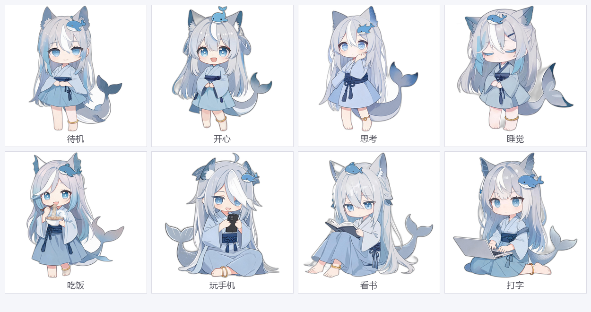
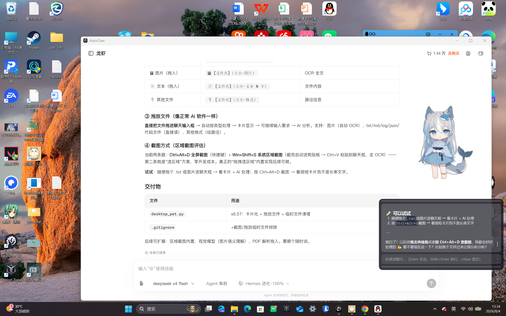

# DeepSeek 桌宠助手 🐋⚡


一只住在你电脑里的 Q 版桌宠：会陪你聊天、帮你干活、还能主动关心你。


> 基于 PySide6 + DeepSeek API 的桌面 AI 陪伴助手，支持双角色、长期记忆、工具调用、主动关心机制。

> ⚠️ 本项目为第三方开源项目，与 DeepSeek（深度求索）公司无任何关联，仅使用其公开 API。所有角色形象均为 AI 生成，不代表官方。

**[English](README.en.md) | [中文](README.md)**

## 📸 截图

| 双角色立绘 | 表情与动作 | 运行实拍 |
|---------|---------|---------|
|  |  |  |

## ✨ 特性

### 🎭 双显示模式（v6.31）
- **静态立绘模式**（默认）：单张 Q 版立绘，呼吸/眨眼/呆毛动画，轻量省资源
- **Live2D 模式**：30fps 连续动画——头部摆动/眨眼/呼吸/视线跟随/点击动作，右键菜单一键切换，配置持久化
- **Live2D 模型库**：自动扫描 `assets/live2d/` 目录，放入任意 `.model3.json` 模型文件夹即可在菜单中选用（当前内置官方 Mao 演示模型）
- 透明 OpenGL 内嵌渲染，两种模式完整保留拖拽/扒边/聊天等全部交互

### 🎭 双角色系统
| 角色 | 模型 | 特征 |
|------|------|------|
| **V4 Flash** ⚡ | `deepseek-v4-flash` | 浅蓝和服人鱼 · 快言快语 · 效率优先 |
| **V4 Pro** 🐋 | `deepseek-v4-pro` | 深蓝女仆鲸鱼娘 · 深思熟虑 · 深度分析 |

每个角色独立模型、独立对话历史、独立长期记忆。

### 🤖 AI 能力（function calling）
- **15+ 工具**：打开程序 / 查天气 / 设提醒 / 锁屏 / 音量 / 进程管理 / 文件搜索 / 剪贴板读写 / 待办清单 / 记忆管理等
- **PowerShell 安全执行**：危险操作（删除/关机/格式化）需用户确认，超时 + 输出截断
- **Markdown 渲染**：聊天面板支持表格/代码块/粗体等渲染，流式打字机逐块显示

### 🧠 长期记忆系统
- `memorize` 工具：AI 自主识别并记住用户偏好/事实（按角色隔离）
- 记忆注入 system prompt，带重要度 + 软覆盖 + 遗忘机制
- 会话摘要滚动压缩，长对话不丢关键信息
- 记忆管理 UI：查看 / 删除 / 清空

### 💗 主动关心系统（链式唤醒 + 回访）
- **链式唤醒**：AI 自主调度下次唤醒（10~360 分钟钳制），唤醒时轻量判断是否打扰（空闲检测 + 深夜静默）
- **回访机制**：对话中提到重要事件（去吃饭/考试等）→ AI 安排定时回访，到点主动关心（带状态感知）
- 唤醒判断独立上下文，不污染主对话

### 🖥️ 桌宠体验
- 透明置顶悬浮窗，立绘随情绪切换（[emotion:happy] 等标签），眨眼/呼吸/头发动画
- 右键菜单整合：角色 / 聊天 / 互动 / 贴边 / 动作 / 性格 / 设置 / 记忆管理
- 全局热键 `Ctrl+Alt+P` 呼出聊天
- 系统托盘常驻、开机自启（启动文件夹方案）
- 贴边扒边：拖到屏幕边缘自动贴边，支持扒边/完全消失双模式
- 聊天面板：多行自适应输入框、上下左右拖拽调整、时间戳、聊天记录导出

## 🚀 快速开始

```powershell
# 1. 安装依赖
python -m pip install -r requirements.txt
# （可选）Live2D 模式：python -m pip install live2d-py pyopengl

# 2. 准备配置（复制模板并填入你的 API Key）
copy config.example.json config.json
# 编辑 config.json，填入 deepseek_api_key

# 3. 运行
python desktop_pet.py
```

首次运行后也可以用 GUI 配置：右键桌宠 → ⚙️ 设置 → 🔑 API 设置。

> ⚠️ **需要自备 DeepSeek API Key**（https://platform.deepseek.com 申请，模型 `deepseek-v4-flash` / `deepseek-v4-pro`）。

## ⚙️ 配置

`config.json`（参考 `config.example.json`）：

| 字段 | 说明 |
|------|------|
| `deepseek_api_key` | DeepSeek API Key（必填） |
| `model_flash` / `model_pro` | 两个角色各自的模型 ID |
| `personality` | 性格（温柔/傲娇/吐槽/元气/高冷，或自定义） |
| `reply_style` | 回复风格（short/normal/detailed） |
| `max_tokens` | 单次回复 token 上限（256-64000） |
| `city` | 默认天气城市 |
| `active_chat` | 主动关心开关 |
| `app_aliases` | 自定义应用快捷别名 |

## 🏗️ 技术架构

```
┌─────────────────────────────────────────┐
│  PySide6 GUI（透明窗口/立绘/气泡/聊天面板）   │
├─────────────────────────────────────────┤
│  AI 核心（DeepSeek API + function calling）│
│  · system prompt：身份/性格/记忆/待办/规则    │
│  · 工具循环：LLM 输出意图 JSON → 程序执行     │
│  · 15+ 工具（安全校验 + 用户确认）            │
├─────────────────────────────────────────┤
│  记忆系统（memory.json，角色隔离）            │
│  主动关心（链式唤醒 + 回访 + 状态感知）        │
│  系统集成（托盘/热键/自启/贴边/剪贴板）        │
└─────────────────────────────────────────┘
```

### 主动消息机制（学习笔记）
详细讲解了 LLM 无状态本质、Function Calling、链式唤醒/回访机制的设计与实现，见 `主动消息机制学习笔记.md`。

## 📁 项目结构

```
desktop-pet/
├── desktop_pet.py              # 主程序（单文件 ~4000 行，章节注释分区）
├── requirements.txt            # 依赖清单（PySide6 + 可选 live2d）
├── pyproject.toml              # 项目元数据 / ruff 配置
├── config.example.json         # 配置模板
├── 启动桌宠.bat                # Windows 一键启动
├── tests/
│   └── smoke_test.py           # 冒烟测试（导入/构造/核心函数）
├── assets/                     # 素材目录
│   ├── flash/                  # V4 Flash 状态立绘
│   ├── pro/                    # V4 Pro 状态立绘
│   └── live2d/                 # Live2D 模型库（扫描选用，自输入模型放这里）
├── docs/
│   └── live2d_pipeline.md      # Live2D 自生成人物完整流程（Seedream→PS→Cubism）
├── screenshots/                # README 展示截图
├── 主动消息机制学习笔记.md       # AI 主动机制学习文档
├── CHANGELOG.md                # 版本变更记录
├── CONTRIBUTING.md             # 贡献指南
├── SECURITY.md                 # 安全策略
├── CODE_OF_CONDUCT.md          # 行为准则
├── .github/                    # Issue / PR 模板
└── README.md
```

### 源码地图（想学习从哪看起）

| 想了解 | 搜索 `desktop_pet.py` 中的章节标记 |
|--------|----------------------------------|
| 工具调用体系 | `# ===== 工具` / `def _call_` |
| AI 状态预判 | `# ===== AI 状态预判` |
| 记忆系统 | `# ===== 记忆` / `def _save_memory` |
| 主动关心/唤醒 | `# ===== 主动` / `def _chain_wake` |
| Live2D 渲染 | `# ===== Live2D` / `def _create_l2d` |
| 语义搜索 | `# ===== 语义` / `def _smart_find_app` |
| 双语国际化 | `_TEXT_ZH` / `_TEXT_EN` 字典 |
| 界面交互 | `def _build_menu` / `def _open_chat_panel` |

## 📦 打包为 exe

```powershell
python -m PyInstaller --noconfirm --clean --onedir --windowed --name DeepSeekPet `
  --collect-all PySide6 --collect-all shiboken6 `
  --specpath release_build --workpath release_build\build --distpath release_build\dist `
  desktop_pet.py
```

> ⚠️ PyInstaller 必须 ≥ 6.21（支持 Python 3.14）；打包后删除 `_internal` 里的 `icu*.dll`（会干扰 Qt6Core，spec 已内置排除规则）。

## 🤝 贡献 / 扩展方向

想学习或贡献？先看 [CONTRIBUTING.md](CONTRIBUTING.md)（含源码阅读路线图）。

- [ ] 前台窗口感知（判断用户在忙什么）
- [ ] 更多角色 / Live2D 骨骼动画
- [ ] 语音交互（TTS/ASR）
- [ ] 插件化工具系统

## 📄 License

[MIT](LICENSE)

---

**免责声明**：本项目仅供学习交流。立绘素材由 AI 生成，使用请遵守相应生成工具的条款。
